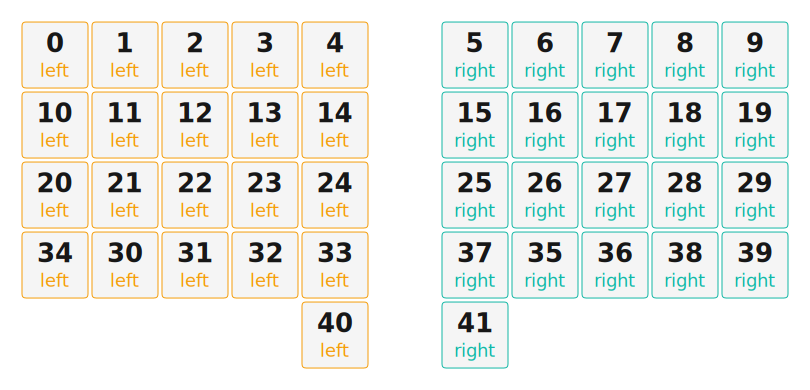

# ZMK Configuration for theduplex

*Generated by Shield Wizard for ZMK*



Download compiled firmware from the Actions tab. <https://zmk.dev/docs/user-setup#installing-the-firmware>

Edit your keymap <https://zmk.dev/docs/keymaps>.
User keymap is located at [`config/theduplex.keymap`](config/theduplex.keymap).

-----

<details>
<summary>
Shield Wizard Debug Information
</summary>

In case of broken configuration, here is the Shield Wizard internal data used to generate this configuration:

Commit: 5840d41ac0915092c8fe45da617ffb4bb91e1b97

```json
{"name":"theduplex","shield":"theduplex","dongle":false,"modules":[],"layout":[{"id":"01KPE7VY75VQG8X8NXA73FHZZ5","part":0,"row":0,"col":0,"w":1,"h":1,"x":0,"y":0,"r":0,"rx":0,"ry":0},{"id":"01KPE7VY756XJAW1SGFM1PVV0K","part":0,"row":0,"col":1,"w":1,"h":1,"x":1,"y":0,"r":0,"rx":0,"ry":0},{"id":"01KPE7VY757W767PT2DV153NVZ","part":0,"row":0,"col":2,"w":1,"h":1,"x":2,"y":0,"r":0,"rx":0,"ry":0},{"id":"01KPE7VY75J0AHX2JWJQ1YJ0Q9","part":0,"row":0,"col":3,"w":1,"h":1,"x":3,"y":0,"r":0,"rx":0,"ry":0},{"id":"01KPE7VY7521ZQ1VZY5ATBWNP7","part":0,"row":0,"col":4,"w":1,"h":1,"x":4,"y":0,"r":0,"rx":0,"ry":0},{"id":"01KPE7VY756BT1QM9FJ3Q3VFJ7","part":1,"row":0,"col":6,"w":1,"h":1,"x":6,"y":0,"r":0,"rx":0,"ry":0},{"id":"01KPE7VY76N68V6PT13WSNY2ZX","part":1,"row":0,"col":7,"w":1,"h":1,"x":7,"y":0,"r":0,"rx":0,"ry":0},{"id":"01KPE7VY76TSFJYMR1KB3R3VMG","part":1,"row":0,"col":8,"w":1,"h":1,"x":8,"y":0,"r":0,"rx":0,"ry":0},{"id":"01KPE7VY76B33NKYDKN5Y4ZBRK","part":1,"row":0,"col":9,"w":1,"h":1,"x":9,"y":0,"r":0,"rx":0,"ry":0},{"id":"01KPE7VY76MK1N20V5BEJ7447F","part":1,"row":0,"col":10,"w":1,"h":1,"x":10,"y":0,"r":0,"rx":8,"ry":0},{"id":"01KPE7VY766XCXP72CJCY30H13","part":0,"row":1,"col":0,"w":1,"h":1,"x":0,"y":1,"r":0,"rx":3,"ry":3.35},{"id":"01KPE7VY76TJED8D1G4TK5M2BK","part":0,"row":1,"col":1,"w":1,"h":1,"x":1,"y":1,"r":0,"rx":3,"ry":3.35},{"id":"01KPE7VY763HP2DBWSEBD9B4PT","part":0,"row":1,"col":2,"w":1,"h":1,"x":2,"y":1,"r":0,"rx":3,"ry":3.35},{"id":"01KPE7VY763AASAXJFMKGA7WAJ","part":0,"row":1,"col":3,"w":1,"h":1,"x":3,"y":1,"r":0,"rx":3,"ry":3.35},{"id":"01KPE7VY76C50W7GDM9FSA4VMW","part":0,"row":1,"col":4,"w":1,"h":1,"x":4,"y":1,"r":0,"rx":3,"ry":3.35},{"id":"01KPE7VY76KT56BGZ9APCMNC0T","part":1,"row":1,"col":6,"w":1,"h":1,"x":6,"y":1,"r":0,"rx":8,"ry":3.35},{"id":"01KPE7VY76WYW3663CQGWPBXB5","part":1,"row":1,"col":7,"w":1,"h":1,"x":7,"y":1,"r":0,"rx":8,"ry":3.35},{"id":"01KPE7VY76K6GG8335M4RHDC29","part":1,"row":1,"col":8,"w":1,"h":1,"x":8,"y":1,"r":0,"rx":8,"ry":3.35},{"id":"01KPE7VY76KHJ9MVVQ2WMVAM5W","part":1,"row":1,"col":9,"w":1,"h":1,"x":9,"y":1,"r":0,"rx":8,"ry":3.35},{"id":"01KPE7VY76T758Z4C67M2M6D48","part":1,"row":1,"col":10,"w":1,"h":1,"x":10,"y":1,"r":0,"rx":8,"ry":3.35},{"id":"01KPE7VY7653ZZQ4QR7B0WBH6C","part":0,"row":2,"col":0,"w":1,"h":1,"x":0,"y":2,"r":0,"rx":3,"ry":3.35},{"id":"01KPE7VY76C2CNF9BX5GV2J6GW","part":0,"row":2,"col":1,"w":1,"h":1,"x":1,"y":2,"r":0,"rx":3,"ry":3.35},{"id":"01KPE7VY76J7AJJ0MBJV75KDPD","part":0,"row":2,"col":2,"w":1,"h":1,"x":2,"y":2,"r":0,"rx":3,"ry":3.35},{"id":"01KPE7VY76Q5M9F0XDYD3S2SHQ","part":0,"row":2,"col":3,"w":1,"h":1,"x":3,"y":2,"r":0,"rx":3,"ry":3.35},{"id":"01KPE7VY76XEBXTG1PAWJ6WD2M","part":0,"row":2,"col":4,"w":1,"h":1,"x":4,"y":2,"r":0,"rx":3,"ry":3.35},{"id":"01KPE7VY76PYDFCB0JXJPD39QT","part":1,"row":2,"col":6,"w":1,"h":1,"x":6,"y":2,"r":0,"rx":8,"ry":3.35},{"id":"01KPE7VY76QEC7HQS8F0YWHRZF","part":1,"row":2,"col":7,"w":1,"h":1,"x":7,"y":2,"r":0,"rx":8,"ry":3.35},{"id":"01KPE7VY76QRYQ87MGV7QDKSJN","part":1,"row":2,"col":8,"w":1,"h":1,"x":8,"y":2,"r":0,"rx":8,"ry":3.35},{"id":"01KPE7VY7654926B7SFSN0XANY","part":1,"row":2,"col":9,"w":1,"h":1,"x":9,"y":2,"r":0,"rx":8,"ry":3.35},{"id":"01KPE7VY76GDBXYJ0V41T58NTD","part":1,"row":2,"col":10,"w":1,"h":1,"x":10,"y":2,"r":0,"rx":8,"ry":3.35},{"id":"01KPE7ZJSGASBPJY472KG8ZZ3P","part":0,"row":3,"col":0,"w":1,"h":1,"x":1,"y":3,"r":0,"rx":0,"ry":0},{"id":"01KPE7ZH8ZD3ZG4D3VQT9D33SH","part":0,"row":3,"col":1,"w":1,"h":1,"x":2,"y":3,"r":0,"rx":0,"ry":0},{"id":"01KPE7VY76NFPENQQCJ2SXNWVA","part":0,"row":3,"col":2,"w":1,"h":1,"x":3,"y":3,"r":0,"rx":4,"ry":0},{"id":"01KPE7ZJ12CCWFNFEHDSZXTSG2","part":0,"row":3,"col":3,"w":1,"h":1,"x":4,"y":3,"r":0,"rx":0,"ry":0},{"id":"01KPE7VY76S5S1WDK84R68MVHR","part":0,"row":3,"col":4,"w":1,"h":1,"x":0,"y":3,"r":0,"rx":0,"ry":0},{"id":"01KPE7VY76B6G81HZP62AWFEKT","part":1,"row":3,"col":6,"w":1,"h":1,"x":7,"y":3,"r":0,"rx":0,"ry":0},{"id":"01KPE7VY76DEASG9X4V4CNBN6E","part":1,"row":3,"col":7,"w":1,"h":1,"x":8,"y":3,"r":0,"rx":0,"ry":0},{"id":"01KPE7VY76HB8M4DWGQJ9NCD1W","part":1,"row":3,"col":8,"w":1,"h":1,"x":6,"y":3,"r":0,"rx":0,"ry":0},{"id":"01KPE80VF2NRG5GWS49VJC1YGQ","part":1,"row":3,"col":9,"w":1,"h":1,"x":9,"y":3,"r":0,"rx":0,"ry":0},{"id":"01KPE80VMSA125PSCCCJTH005S","part":1,"row":3,"col":10,"w":1,"h":1,"x":10,"y":3,"r":0,"rx":0,"ry":0},{"id":"01KPE81EKJP6CJW1HD00FPSE05","part":0,"row":4,"col":4,"w":1,"h":1,"x":4,"y":4,"r":0,"rx":0,"ry":0},{"id":"01KPE81EQQHD6W4DYYYT47E3WH","part":1,"row":4,"col":6,"w":1,"h":1,"x":6,"y":4,"r":0,"rx":0,"ry":0}],"parts":[{"name":"left","controller":"xiao_ble","wiring":"matrix_diode","pins":{"d7":"input","d8":"input","d9":"input","d10":"input","d1":"output","d2":"output","d3":"output","d4":"output","d5":"output","d6":"input"},"keys":{"01KPE7VY75Y32KKV04KFHHQTF1":{"input":"d7"},"01KPE7VY75VQG8X8NXA73FHZZ5":{"input":"d7","output":"d1"},"01KPE7VY756XJAW1SGFM1PVV0K":{"input":"d7","output":"d2"},"01KPE7VY757W767PT2DV153NVZ":{"input":"d7","output":"d3"},"01KPE7VY75J0AHX2JWJQ1YJ0Q9":{"input":"d7","output":"d4"},"01KPE7VY7521ZQ1VZY5ATBWNP7":{"input":"d7","output":"d5"},"01KPE7VY76XYJ2Q2F39VXXBE55":{"input":"d8"},"01KPE7VY766XCXP72CJCY30H13":{"input":"d8","output":"d1"},"01KPE7VY76TJED8D1G4TK5M2BK":{"input":"d8","output":"d2"},"01KPE7VY763HP2DBWSEBD9B4PT":{"input":"d8","output":"d3"},"01KPE7VY763AASAXJFMKGA7WAJ":{"input":"d8","output":"d4"},"01KPE7VY76C50W7GDM9FSA4VMW":{"input":"d8","output":"d5"},"01KPE7VY76KSH5MW4Z5XZACMTD":{"input":"d9"},"01KPE7VY7653ZZQ4QR7B0WBH6C":{"input":"d9","output":"d1"},"01KPE7VY76C2CNF9BX5GV2J6GW":{"input":"d9","output":"d2"},"01KPE7VY76J7AJJ0MBJV75KDPD":{"input":"d9","output":"d3"},"01KPE7VY76Q5M9F0XDYD3S2SHQ":{"input":"d9","output":"d4"},"01KPE7VY76XEBXTG1PAWJ6WD2M":{"input":"d9","output":"d5"},"01KPE7VY76S5S1WDK84R68MVHR":{"input":"d10","output":"d5"},"01KPE7ZJSGASBPJY472KG8ZZ3P":{"input":"d10","output":"d1"},"01KPE7ZH8ZD3ZG4D3VQT9D33SH":{"input":"d10","output":"d2"},"01KPE7VY76NFPENQQCJ2SXNWVA":{"input":"d10","output":"d3"},"01KPE7ZJ12CCWFNFEHDSZXTSG2":{"input":"d10","output":"d4"},"01KPE7ZJD0JKFXBT52N3FF2JAJ":{"input":"d10"},"01KPE81EKJP6CJW1HD00FPSE05":{"input":"d6","output":"d5"}},"encoders":[],"buses":[{"name":"spi0","devices":[],"type":"spi"},{"name":"spi1","devices":[],"type":"spi"},{"name":"spi2","devices":[],"type":"spi"},{"name":"spi3","devices":[],"type":"spi"},{"name":"i2c0","devices":[],"type":"i2c"},{"name":"i2c1","devices":[],"type":"i2c"}]},{"name":"right","controller":"xiao_ble","wiring":"matrix_diode","pins":{"d7":"input","d8":"input","d9":"input","d10":"input","d1":"output","d2":"output","d3":"output","d4":"output","d5":"output","d6":"input"},"keys":{"01KPE7VY756BT1QM9FJ3Q3VFJ7":{"input":"d7","output":"d5"},"01KPE7VY76N68V6PT13WSNY2ZX":{"input":"d7","output":"d4"},"01KPE7VY76TSFJYMR1KB3R3VMG":{"input":"d7","output":"d3"},"01KPE7VY76B33NKYDKN5Y4ZBRK":{"input":"d7","output":"d2"},"01KPE7VY76MK1N20V5BEJ7447F":{"input":"d7","output":"d1"},"01KPE7VY76KT56BGZ9APCMNC0T":{"input":"d8","output":"d5"},"01KPE7VY76WYW3663CQGWPBXB5":{"input":"d8","output":"d4"},"01KPE7VY76K6GG8335M4RHDC29":{"input":"d8","output":"d3"},"01KPE7VY76KHJ9MVVQ2WMVAM5W":{"input":"d8","output":"d2"},"01KPE7VY76T758Z4C67M2M6D48":{"input":"d8","output":"d1"},"01KPE7VY76PYDFCB0JXJPD39QT":{"input":"d9","output":"d5"},"01KPE7VY76QEC7HQS8F0YWHRZF":{"input":"d9","output":"d4"},"01KPE7VY76QRYQ87MGV7QDKSJN":{"input":"d9","output":"d3"},"01KPE7VY7654926B7SFSN0XANY":{"input":"d9","output":"d2"},"01KPE7VY76GDBXYJ0V41T58NTD":{"input":"d9","output":"d1"},"01KPE7VY76B6G81HZP62AWFEKT":{"input":"d10","output":"d5"},"01KPE7VY76DEASG9X4V4CNBN6E":{"input":"d10","output":"d4"},"01KPE7VY76HB8M4DWGQJ9NCD1W":{"input":"d10","output":"d3"},"01KPE80VF2NRG5GWS49VJC1YGQ":{"input":"d10","output":"d2"},"01KPE80VMSA125PSCCCJTH005S":{"input":"d10","output":"d1"},"01KPE81EQQHD6W4DYYYT47E3WH":{"input":"d6","output":"d5"}},"encoders":[],"buses":[{"name":"spi0","devices":[],"type":"spi"},{"name":"spi1","devices":[],"type":"spi"},{"name":"spi2","devices":[],"type":"spi"},{"name":"spi3","devices":[],"type":"spi"},{"name":"i2c0","devices":[],"type":"i2c"},{"name":"i2c1","devices":[],"type":"i2c"}]}]}
```

</details>
